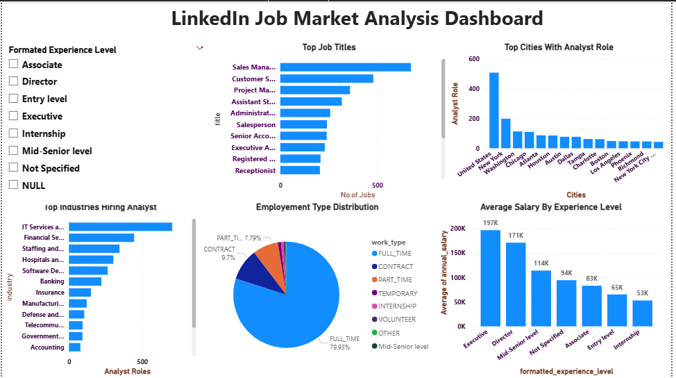

# LinkedIn Job Market Analysis

An end-to-end data analytics project exploring **122,000+ LinkedIn job postings** to uncover hiring trends, salary patterns, and in-demand skills across the U.S. job market in 2023-2024.

This project follows a complete analyst workflow — from raw data cleaning in Python, to business-question querying in SQL, to pivot-table analysis in Excel, to a final interactive dashboard in Power BI.



---

## 📌 Project Overview

| | |
|---|---|
| **Dataset** | [LinkedIn Job Postings 2023-2024](https://www.kaggle.com/datasets/arshkon/linkedin-job-postings) (Kaggle) |
| **Records analyzed** | 122,617 job postings |
| **Tools used** | Python, SQL (MySQL), Excel, Power BI |
| **Project type** | End-to-end data analyst portfolio project |

---

## ❓ Business Questions Answered

1. What are the most in-demand job titles and skills?
2. Which cities have the most Data Analyst job openings?
3. What is the distribution of employment types (full-time, contract, part-time, etc.)?
4. What is the average salary by experience level?
5. Which industries hire the most Data Analysts?

---

## 🛠️ Workflow

```
Raw CSV (Kaggle)
      │
      ▼
[1] Python  →  Data cleaning, deduplication, salary normalization, EDA
      │
      ▼
[2] SQL     →  Business question queries (MySQL)
      │
      ▼
[3] Excel   →  Pivot tables + summary sheet
      │
      ▼
[4] Power BI →  Interactive dashboard
```

### Step 1 — Python (Data Cleaning & EDA)
- Loaded and merged 5 source tables (`postings`, `companies`, `job_skills`, `industries`, `job_industries`)
- Removed duplicate records and rows with missing critical fields
- Standardized salary data into a single `annual_salary` field (converted hourly rates to annual, filtered unrealistic values)
- Extracted city-level location data
- Performed exploratory analysis with charts for all 5 business questions

📂 See: [`notebooks/01_cleaning_eda.ipynb`](notebooks/01_cleaning_eda.ipynb)

### Step 2 — SQL (Business Question Queries)
- Loaded cleaned data into a MySQL database
- Wrote aggregation queries (`GROUP BY`, `COUNT`, `AVG`, subqueries) to directly answer each business question

📂 See: [`sql/sqlfile.sql`](sql/sqlfile.sql)

### Step 3 — Excel (Pivot Tables & Summary)
- Built 6 pivot tables covering job titles, skills, cities, employment type, salary, and industries
- Created a consolidated summary sheet with key metrics

📂 See: [`excel/job_analysis_summary.xlsx`](excel/job_analysis_summary.xlsx)

### Step 4 — Power BI (Interactive Dashboard)
- Built a single-page interactive dashboard with 6 visuals
- Added a slicer to filter all visuals by experience level
- Applied a custom theme for a polished, professional look

📂 See: [`powerbi/LinkedIn_Dashboard.pbix`](powerbi/LinkedIn_Dashboard.pbix)

---

## 📊 Key Insights

- **Top job titles**: Sales Manager, Customer Service Representative, and Project Manager were the most frequently posted roles.
- **Top skill categories**: IT, Sales, and Management-tagged postings were the most common across the dataset.
- **Geographic concentration**: New York, Washington, and Chicago lead in Analyst-specific job openings.
- **Employment type**: ~80% of postings are full-time, with contract roles making up the next largest share (~10%).
- **Salary by experience**: Average salary rises sharply with seniority — from ~$53K (Internship) to ~$197K (Executive level).
- **Top hiring industries for Analysts**: IT Services & Consulting, Financial Services, and Staffing & Recruiting lead the way.

---

## 📁 Repository Structure

```
linkedin-job-market-analysis/
├── data/
│   └── cleaned/              # Cleaned datasets + EDA chart exports
├── notebooks/
│   └── 01_cleaning_eda.ipynb # Python: cleaning & exploratory analysis
├── sql/
│   └── sqlfile.sql            # SQL queries for all 5 business questions
├── excel/
│   └── job_analysis_summary.xlsx  # Pivot tables + summary sheet
├── powerbi/
│   └── LinkedIn_Dashboard.pbix    # Interactive Power BI dashboard
├── images/
│   └── dashboard_screenshot.png
└── README.md
```

> **Note:** Raw source CSV files are not included in this repository due to size. They can be downloaded directly from the [Kaggle dataset page](https://www.kaggle.com/datasets/arshkon/linkedin-job-postings).

---

## 🚀 How to Reproduce

1. Download the dataset from [Kaggle](https://www.kaggle.com/datasets/arshkon/linkedin-job-postings) (`postings.csv`, `job_skills.csv`, `companies.csv`, `industries.csv`, `job_industries.csv`)
2. Place the files in a `data/raw/` folder
3. Run the notebook in `notebooks/01_cleaning_eda.ipynb` to generate cleaned data
4. Load the cleaned data into MySQL and run queries from `sql/sqlfile.sql`
5. Open `excel/job_analysis_summary.xlsx` to explore the pivot tables
6. Open `powerbi/LinkedIn_Dashboard.pbix` in Power BI Desktop to explore the interactive dashboard

---

## 🧰 Tools & Technologies

`Python` · `pandas` · `matplotlib` · `seaborn` · `MySQL` · `Microsoft Excel` · `Power BI`

---

## 👤 Author

**Mohammed Arman Ali**
🔗 [GitHub](https://github.com/MOHAMMEDARMANALI)
